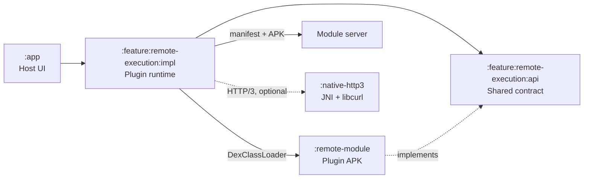

# Клиентская plugin-архитектура

| Модуль | Роль |
| --- | --- |
| `:app` | Host: показывает UI и запускает сценарий. |
| `:feature:remote-execution:api` | Стабильный контракт между host и plugin: `RemoteFeature` / `RemoteComposeFeature`. |
| `:feature:remote-execution:impl` | Plugin runtime: получает manifest, скачивает и проверяет APK, затем загружает entry point. |
| `:remote-module` | Plugin APK с конкретными feature; собирается против API через `compileOnly`. |
| `:native-http3` | Необязательный транспорт HTTP/3; не участвует в загрузке классов. |

Перед запуском host проверяет совместимость API, SHA-256 APK, тип feature и совпадение её `id`/`version` с manifest. Проверенный APK сохраняется во внутреннее read-only хранилище, после чего `DexClassLoader` создаёт только разрешённый manifest entry point.
